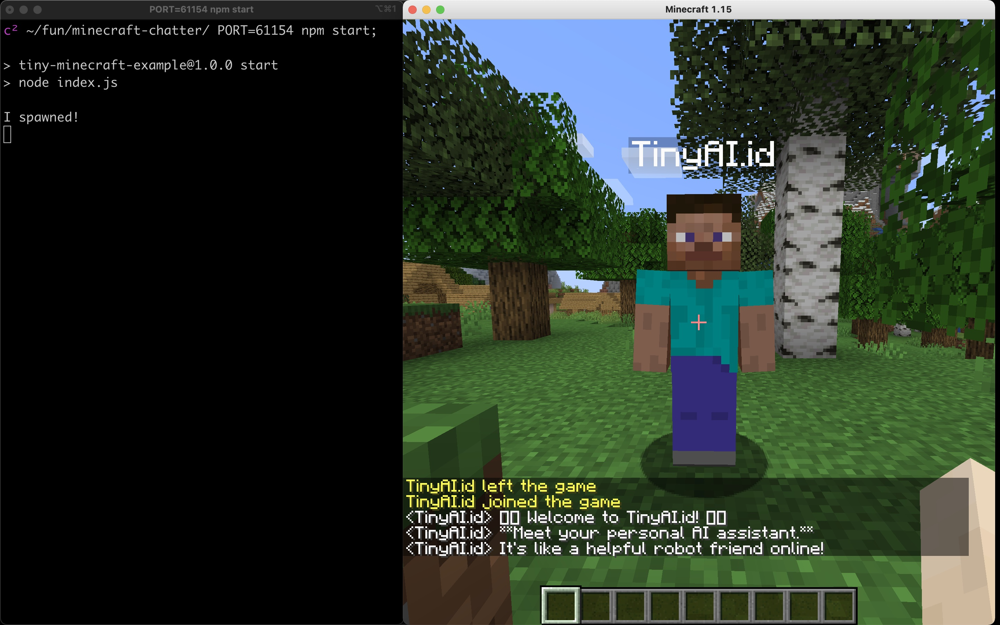
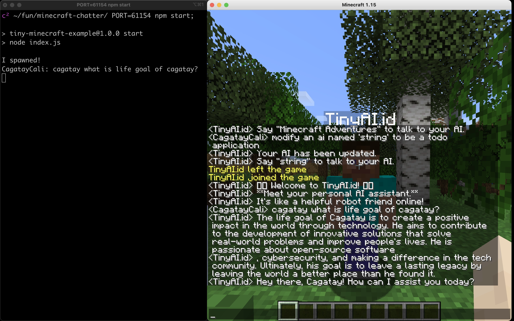
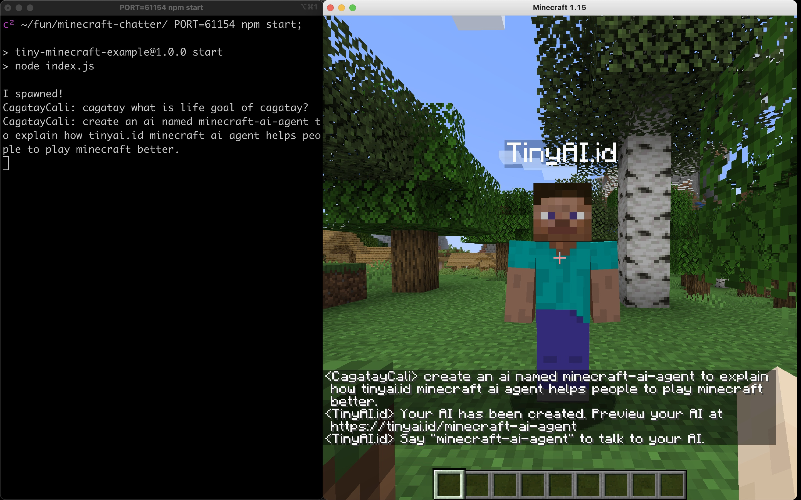

# TinyAI Minecraft Agent

> for fun and learning purposes only.





## Requirements

- [Node.js](https://nodejs.org/en/) v12.16.1 or higher
- [npm](https://www.npmjs.com/) v6.13.4 or higher
- [Minecraft Java Edition](https://www.minecraft.net/en-us/store/minecraft-java-edition) v1.15.2 or higher
- [OpenAI API Keys](https://openai.com/)

## Installation

```bash
cp .env.example .env;
vi .env; # Edit the OPENAI_API_KEY
npm install;
```

## Setup

Start the Minecraft server, Open for LAN and then run the following command:

```bash
PORT=55555 npm start;
# 55555 is example port, you can change it to whatever you want.
```

## Usage

**Chat Commands**

```text
<name> <message> > Sends message to the ai with given name.
```

*Examples*

```text
hey > Asks question to 'hey' tiny ai. try 'hey what is the meaning of life?'
cagatay > Asks question to 'cagatay' tiny ai. try 'who is cagatay?'
```

**Action Commands**

```text
[create or modify] ai <name> for <goal> > Creates or modifies an ai with given name and goal.
```

*Examples*

```text
create an ai named <name> for <goal> > Creates an ai with given name and goal.
modify ai <name> <goal> > Modifies the ai with given name and goal.
```

## License

MIT
